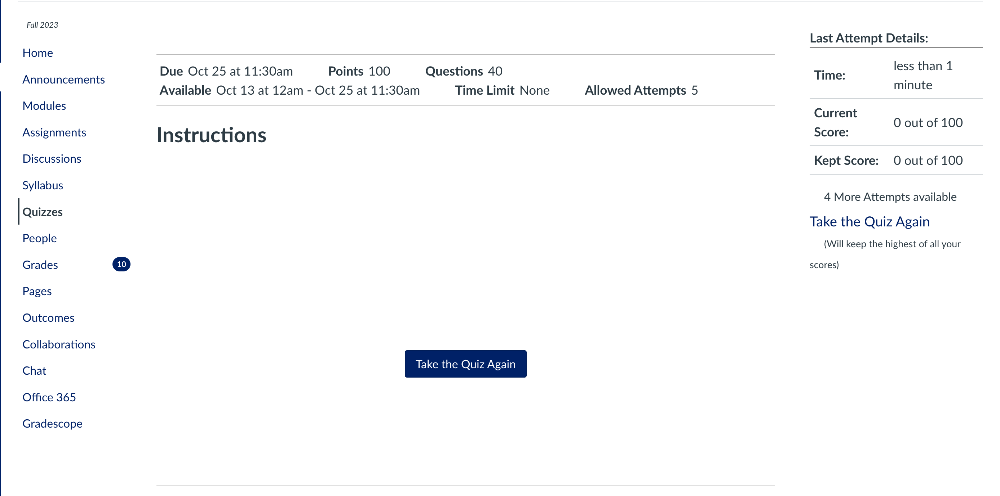
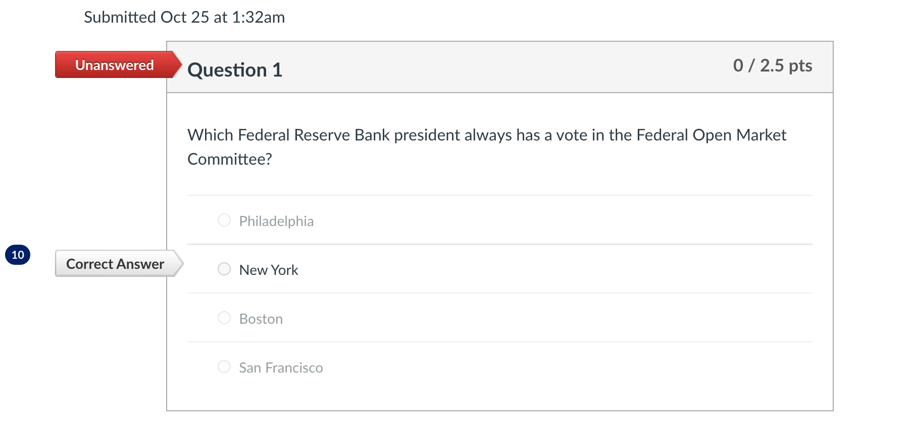
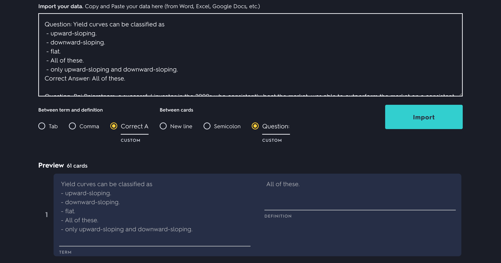

# CanvasScrape Tool

## Overview 🚀
CanvasScrape Tool is a Python script designed to extract quiz-related content such as questions, answer choices, and correct answers from given HTML files. It's particularly useful for educators and students who want to convert content from HTML files into a more manageable format.


## Installation 📦
1. Clone the repository or download the script.
2. Navigate to the project directory in your terminal.
3. Install the required Python packages using pip:
   ```
   pip install -r requirements.txt
   ```
   
## Usage 🛠
### Inputting HTML Files
* **Command Line**: Provide the paths to your HTML files directly when running the script.
* **Interactive Mode**: If you don't provide file paths via the command line, the script will switch to interactive mode.

🖼 Here's how the Canvas interface looks when you're poised to save the HTML content:






### Data Extraction 🔍
The script reads the content of each provided HTML file and uses the BeautifulSoup library to parse the HTML. 
After extraction, you have the option to remove any duplicate data.
You can choose between a plain text format (txt) or a CSV format (csv).

## Importing to Quizlet 🧠
To import the extracted data into Quizlet:

1. Log in to your Quizlet account.
2. Click on "Create" at the top of the page.
3. Select "Import from Word, Excel, Google Docs, etc."
4. Copy the data from the .txt or .csv file and paste it into the import box in Quizlet.
5. Use "Question:" as the per card delimiter. Use "Correct Answer" between term and definition

Below is an example of properly importing to Quizlet (from a .txt file):



